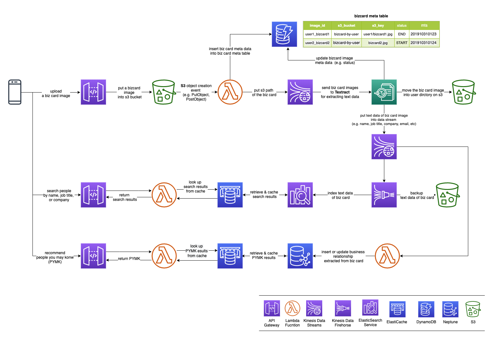

# Octember<sup>TM</sup>

- OCR(Optical Character Reconition) 기술을 활용한 명함 관리 및 Graph database(Neptune)을 이용한 인맥 추천 서비스

### Architecture


##### Key AWS Services
- API Gateway
- Lambda Function
- Kinesis Data Stream
- Kinesis Data Firehorese
- Elasticsearch Service
- ElastiCache
- DynamoDB
- Neptune
- S3
- Textract

### RESTful API Specification
##### Image upload
- Request
  - PUT
    ```
    - /v1/{bucket}/{object}
    ```

    | URL Path parameters | Description | Required(Yes/No) | Data Type |
    |---------------------|-------------|------------------|-----------|
    | bucket | s3 bucket 이름 | Yes | String |
    | object | s3 object 이름 | Yes | String |

  - ex)
    ```
    curl -X PUT "https://t2e7cpvqvu.execute-api.us-east-1.amazonaws.com/v1/octember-use1/bizcard-raw-img%2Fbar_s20191101_125236.jpg" \
         --data @bar_s20191101_125236.jpg
    ```

- Response
  - No Data

##### Search
- Request
  - GET
    ```
    - /v1/search?query=isv&user=foobar&limit=10
    ```

    | Key | Description | Required(Yes/No) | Data Type |
    |-----|-------------|------------------|-----------|
    | query | 검색 질의어 (name, job title, company, address) | No | String |
    | user | 검색 결과 필터링 조건 (biz card를 등록한 user id) | No | String |
    | limit | 검색 결과 개수 (기본 값: 10) | No | Integer |
    
    - (&#33;) **query** 혹은 **user** 중 하나의 값은 반드시 필요함

  - ex)
      ```
      curl -X GET "https://gfrgyj029q.execute-api.us-east-1.amazonaws.com/v1/search?query=architect&limit=2"
      ```

- Response
  - meta 데이터

    | Key | Description | Data Type |
    |-----|-------------|-----------|
    | _index | Elasticsearch Index 이름 | String |
    | _type | Elasticsearch Type 이름 | String |
    | _id | 문서 id | String |
    | _score | 검색 결과 Relevance 점수 | String |
    | _source | | JSON |

  - _source 데이터

    | Key | Description | Data Type |
    |-----|-------------|-----------|
    | doc_id | 문서 id | String |
    | name | 이름 | String |
    | phone_number | 전화 번호 | String |
    | email | email 주소 | String |
    | job_title | 회사 직함 | String |
    | company | 회사 이름 | String |
    | addr | 회사 주소 | String |
    | is_alive | 문서 삭제 여부 플래그(0: 삭제, 1: 검색 가능한 문서) | Integer |
    | owner | 명함 등록 사용자 id | String |
    | image_id | 명함 이미지 파일 이름 | String |
    | content_id | 중복 문서 제거를 위한 문서 내용 id | String |
    | created_at | 문서 생성 시간 | String |

  - ex)
    ```
    [
        {
            "_index": "octember_bizcard",
            "_type": "bizcard",
            "_id": "dfb6c487",
            "_score": 0.5619609,
            "_source": {
                "addr": "508, Nonhyeon-ro, Gangnam-gu Seoul, 06141, Rep. of KOREA",
                "email": "foo@amazon.com",
                "phone_number": "(+82 10) 2135 1294 ",
                "company": "aws",
                "name": "Foo Lee",
                "job_title": "Solutions Architect",
                "created_at": "2019-11-05T05:20:24Z",
                "doc_id": "dfb6c487",
                "image_id": "bar_s20191101_125236.jpg",
                "owner": "bar",
                "is_alive": 1,
                "content_id": "e2c266fc"
            }
        },
        {
            "_index": "octember_bizcard",
            "_type": "bizcard",
            "_id": "8a78483a",
            "_score": 0.43445712,
            "_source": {
                "addr": "12Floor GS Tower, 508 Nonhyeon-ro Gangnam-gu, Seoul, Korea",
                "email": "bar@amazon.com",
                "phone_number": "(+82 10) 7843 3795 ",
                "company": "aws",
                "name": "Bar Kim",
                "job_title": "ISV Partner Solutions Architect",
                "created_at": "2019-11-05T05:18:28Z",
                "doc_id": "8a78483a",
                "image_id": "foo_j20191101_125250.jpg",
                "owner": "foo",
                "is_alive": 1,
                "content_id": "3064ab8c"
            }
        }
    ]
    ```

##### PYMK(People You May Know)
- Request
  - GET
    ```
    - /v1/pymk?user=foo%20bar&limit=10
    ```

    | Key | Description | Required(Yes/No) | Data Type |
    |-----|-------------|------------------|-----------|
    | user | 인맥 추천을 받고자 하는 사용자 이름 | Yes | String |
    | limit | 인맥 추천 결과 개수 (기본 값: 10) | No | Integer |

  - ex)
      ```
      curl -X GET "https://y2xmtfbduf.execute-api.us-east-1.amazonaws.com/v1/pymk?user=foo%20bar&limit=2"
      ```

- Response
  - body 데이터

    | Key | Description | Data Type |
    |-----|-------------|-----------|
    | name | 이름 | String |
    | phone_number | 전화 번호 | String |
    | email | email 주소 | String |
    | job_title | 회사 직함 | String |
    | company | 회사 이름 | String |
    | score | 인맥 추천 점수 | Float |

  - ex)
    ```
    [
        {
            "name": [
                "Bar Lee"
            ],
            "phone_number": [
                "(+82 10) 3025 7502 "
            ],
            "company": [
                "aws"
            ],
            "job_title": [
                "Solutions Architect"
            ],
            "email": [
                "bar@amazon.com"
            ],
            "score": 4.0
        },
        {
            "name": [
                "Joon Kim"
            ],
            "phone_number": [
                "(+82 10) 7315 3970 "
            ],
            "company": [
                "aws"
            ],
            "job_title": [
                "Partner Solutions Architect"
            ],
            "email": [
                "joon@amazon.com"
            ],
            "score": 3.0
        }
    ]
    ```

### Lambda Functions Overview

| Name | Description | Event Source | IAM Role | VPC | Etc |
|:----:|-------------|--------------|------|-----|-----|
| TriggerTextExtractFromS3Image | biz card 이미지가 s3에 등록되면, text 데이터 추출 작업을 실행 시키는 작업 | S3 ObjectCreated Event | DynamoDB Read/Write, Kinesis Data Stream Read/Write | No VPC | ETL |
| GetTextFromS3Image | textract를 이용해서 biz card 이미지에서 text 데이터를 추출하는 작업 | Kinesis Data Stream | S3 Read/Write, DynamoDB Read/Write, Kinesis Data Stream Read/Write, Textract | | ETL |
| UpsertBizcardToES | biz card의 text 데이터를 ElasticSearch에 색인하는 작업 | Kinesis Data Stream | Kinesis Data Stream Read | | ETL |
| UpsertBizcardToGraphDB | biz card의 text 데이터를 graph database에 load 하는 작업  | Kinesis Data Stream | Kinesis Data Stream Read | | ETL |
| SearchBizcard | biz card를 검색하기 위한 검색 서버 | API Gateway | | | Proxy Server |
| RecommendBizcard | PYMK(People You May Know)를 추천해주는 서버 | API Gateway | | | Proxy Server |
| CustomAuthorizer | 사용자 인증 서버 (Optional) |  | | | API Gateway custom authorizer |

### Data Specification

##### S3에 업로드할 biz card image 파일 이름 형식
- `{user_id}_{image_id}.jpg`
- ex) foobar_i592134.jpg

##### `GetTextFromS3Image` In/Output Data
- Input
  - `{"s3_bucket": "{bucket name}", "s3_key": "{object key}"}`
  - ex) `{"s3_bucket": "octember-use1", "s3_key": "bizcard-raw-img/foobar_i592134.jpg"}`
- Output
  - json data format
      ```
       {
        "s3_bucket": "{bucket name}",
        "s3_key": "{object key}",
        "owner": "{user_id}",
        "data": {
          "addr": "{address}",
          "email": "{email address}",
          "phone_number": "{phone number}",
          "company": "{company name}",
          "name": "{full name}",
          "job_title": "{job title}",
          "created_at": "{created datetime}"
         }
       }
       ```
  - ex) 
      ```
       {
        "s3_bucket": "octember-use1",
        "s3_key": "bizcard-raw-img/foobar_i592134.jpg",
        "owner": "foobar",
        "data": {
          "addr": "12Floor GS Tower, 508 Nonhyeon-ro, Gangnam-gu, Seoul 06141, Korea",
          "email": "foobar@amazon.com",
          "phone_number": "(+82 10) 1025 7049",
          "company": "aws",
          "name": "Foo Bar",
          "job_title": "Solutions Architect",
          "created_at": "2019-10-25T01:12:54Z"
         }
       }
       ```

##### `UpsertBizcardToES` In/Output Data
- Input
  - `GetTextFromS3Image` output data 참고
- Output
  - json data format
      ```
       {
         "doc_id": "md5({image file name})",
         "image_id": "{image file name}",
         "is_alive": {0 - dead, 1 - alive(default)},
         "addr": "{address}",
         "email": "{email address}",
         "phone_number": "{phone number}",
         "company": "{company name}",
         "name": "{full name}",
         "job_title": "{job title}",
         "created_at": "{created datetime}"
       }
       ```
  - ex)
      ```
       {
         "doc_id": "21cf827e",
         "image_id": "foobar_i592134.jpg",
         "is_alive": 1,
         "addr": "12Floor GS Tower, 508 Nonhyeon-ro, Gangnam-gu, Seoul 06141, Korea",
         "email": "foobar@amazon.com",
         "phone_number": "(+82 10) 1025 7049",
         "company": "aws",
         "name": "Foo Bar",
         "job_title": "Solutions Architect",
         "created_at": "2019-10-25T01:12:54Z"
       }
       ```

##### `UpsertBizcardToGraphDB` In/Output Data
- Input
  - `GetTextFromS3Image` output data 참고
- Output
  - Neptune Schema 참고

##### S3 Bucket 및 Directory 구조

| Bucket | Folder | Description |
|--------|--------|-------------|
| {bucket name} | bizcard-raw-img | 사용자가 업로드한 biz card image 원본 저장소 |
| {bucket name} | bizcard-by-user/{user_id} | 업로드된 biz card image를 사용자별로 별도로 보관하는 저장소 |
| {bucket name} | bizcard-text/{YYYY}/{mm}/{dd}/{HH} | biz card image에서 추출한 text 데이터 저장소; 검색을 위한 재색인 및 배치 형태의 텍스트 분석을 위한 백업 저장소 |

##### DynamoDB Schema

| primary key(partition key) | s3_bucket | s3_key | mts | status |
|----------------------------|-----------|--------|-----|--------|
| {user_id}_{image_id}.jpg | s3 bucket | s3 object key | last modified time(yyyymmddHHMMSS) | processing status {START, PROCESSING, END} |
| foobar_i592134.jpg | octember-use1 | bizcard-raw-img/foobar_i592134.jpg | 20191025011254 | END |

##### Neptune Schema

- Vertex

| Vertex Label | Property | Description |
|--------------|----------|-------------|
| person | id, name, email, phone_number, job_title, company | biz card에 있는 인물 정보 |
| person | <pre>{<br/>"id": "3858f622",<br/>"name": "Foo Bar",<br/>"_name": "foo bar",<br/>"email": "foobar@amazon.com",<br/>"phone_number": "(+82 10) 1025 7049",<br/>"job_title": "Solutions Architect",<br/>"company": "aws"<br/>}</pre> | |

- Edge

| Edge Label | Property | Description |
|--------------|----------|-------------|
| knows | weight | biz card를 주고 받은 사람들 간의 관계 (weight: 관계의 중요도) |
| knows | {"weight": 1.0} | |


### References & Tips

##### Lambda

- [자습서: Amazon S3과 함께 AWS Lambda 사용](https://docs.aws.amazon.com/ko_kr/lambda/latest/dg/with-s3-example.html)
- [AWS Lambda 계층](https://docs.aws.amazon.com/ko_kr/lambda/latest/dg/configuration-layers.html)
- Lambda Layer에 등록할 Python 패키지 생성 예제

    ```
    $ python3 -m venv es-lib # virtual environments을 생성함
    $ cd es-lib
    $ source bin/activate
    $ mkdir -p python_modules # 필요한 패키지를 저장할 디렉터리 생성
    $ pip install elasticsearch -t python_modules # 필요한 패키지를 사용자가 지정한 패키지 디렉터리에 저장함
    $ mv python_modules python # 사용자가 지정한 패키지 디렉터리 이름을 python으로 변경함 (python 디렉터리에 패키지를 설치할 경우 에러가 나기 때문에 다른 이름의 디렉터리에 패키지를 설치 후, 디렉터리 이름을 변경함)
    $ zip -r es-lib.zip python/ # 필요한 패키지가 설치된 디렉터리를 압축함
    $ aws s3 cp es-lib.zip s3://my-lambda-layer-packages/python/ # 압축한 패키지를 s3에 업로드 한 후, lambda layer에 패키지를 등록할 때, s3 위치를 등록하면 됨
    ```

##### API Gateway + S3
- [자습서: API Gateway에서 Amazon S3 프록시로 REST API 생성](https://docs.aws.amazon.com/ko_kr/apigateway/latest/developerguide/integrating-api-with-aws-services-s3.html)
- (API Gateway 기본 탐색 창에서) API의 **Settings**에서 **Binary Media Types**에 필요한 미디어 유형(예: image/png, image/jpg)을 입력 후 저장함
- S3에 이미지를 업로드하는 경우 **통합 요청**(Integration Request)의 **HTTP Headers**에서 `x-amz-acl` 헤는 생략하거나 올바른 ACL 값을 설정해야 함
- 이미지를 업로드하거나 다운로드하려면, **통합 요청**(업로드하는 경우) 및 **통합 응답**(다운로드하는 경우)에서 **콘텐츠 처리**(Content Handling)를 `Convert to binary (if needed)` 로 설정해야 합니다.

##### API Gateway + Lambda
- [자습서: Lambda 프록시 통합을 사용하여 Hello World API 빌드](https://docs.aws.amazon.com/ko_kr/apigateway/latest/developerguide/api-gateway-create-api-as-simple-proxy-for-lambda.html)

##### Textract
- [Creating an AWS Lambda Function](https://docs.aws.amazon.com/ko_kr/textract/latest/dg/lambda.html)
- [aws-samples/amazon-textract-code-samples](https://github.com/aws-samples/amazon-textract-code-samples)

##### Elasticsearch Service
- [자습서: Amazon Elasticsearch Service를 사용하여 검색 애플리케이션 생성](https://docs.aws.amazon.com/ko_kr/elasticsearch-service/latest/developerguide/search-example.html)

##### Dynamodb
- [DynamoDB 시작하기](https://docs.aws.amazon.com/ko_kr/amazondynamodb/latest/developerguide/GettingStartedDynamoDB.html)

##### S3(Simple Storage Service)
- [브라우저에서 Amazon S3에 사진 업로드](https://docs.aws.amazon.com/ko_kr/sdk-for-javascript/v2/developer-guide/s3-example-photo-album.html)
- [CORS(Cross-Origin Resource Sharing)](https://docs.aws.amazon.com/ko_kr/AmazonS3/latest/dev/cors.html)

##### Neptune
- [Neptune 시작하기](https://docs.aws.amazon.com/ko_kr/neptune/latest/userguide/get-started.html)
- [Let Me Graph That For You – Part 1 – Air Routes](https://aws.amazon.com/ko/blogs/database/let-me-graph-that-for-you-part-1-air-routes/)
- [aws-samples/amazon-neptune-samples](https://github.com/aws-samples/amazon-neptune-samples)
- [Apache TinkerPop<sup>TM</sup>](http://tinkerpop.apache.org/)

##### Kinesis Data Stream
- [Amazon Kinesis 데이터 스트림 만들기 및 업데이트](https://docs.aws.amazon.com/ko_kr/streams/latest/dev/amazon-kinesis-streams.html)

##### Kinesis Data Firehorse
- [Amazon Kinesis Data Firehose 전송 스트림 생성](https://docs.aws.amazon.com/ko_kr/firehose/latest/dev/basic-create.html)

##### ElasitCache
- [Redis용 Amazon ElastiCache 시작하기](https://docs.aws.amazon.com/ko_kr/AmazonElastiCache/latest/red-ug/GettingStarted.html)

##### VPC
- [VPC 엔드포인트](https://docs.aws.amazon.com/ko_kr/vpc/latest/userguide/vpc-endpoints.html)
  + [Amazon S3에 대한 엔드포인트](https://docs.aws.amazon.com/ko_kr/vpc/latest/userguide/vpc-endpoints-s3.html)
  + [Amazon DynamoDB에 대한 엔드포인트](https://docs.aws.amazon.com/ko_kr/vpc/latest/userguide/vpc-endpoints-ddb.html)
